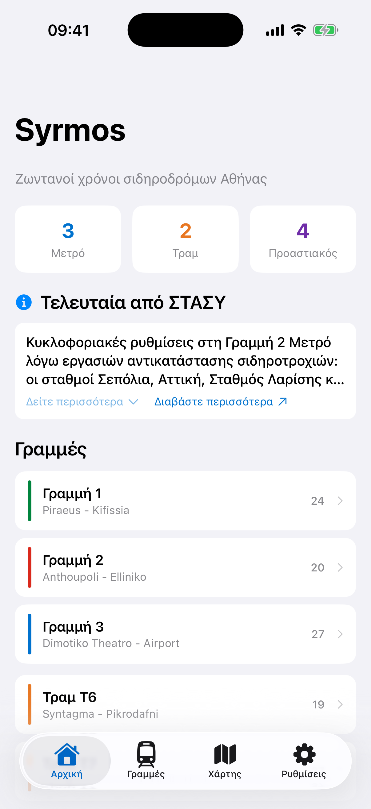
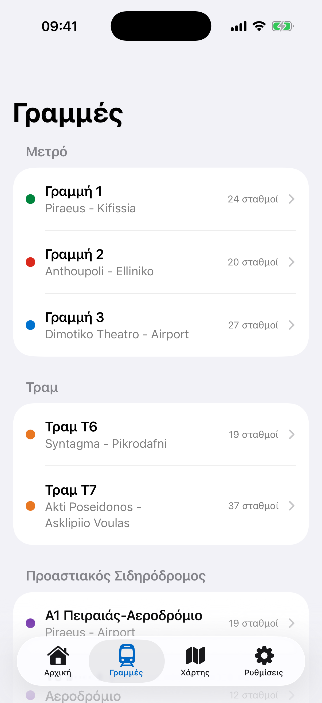
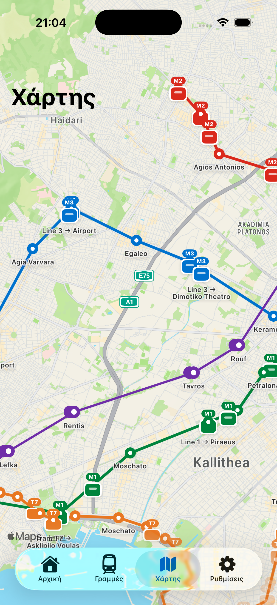
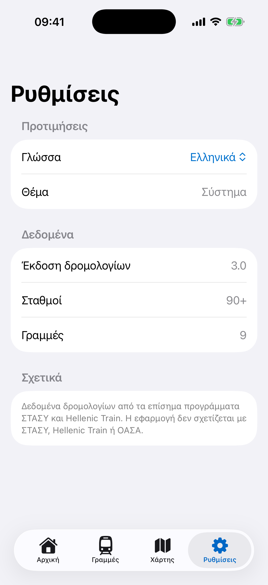

<p align="center">
 
</p>

<h1 align="center">Syrmos</h1>

<p align="center">
  <strong>Your next Athens train, instantly.</strong><br/>
  Metro &bull; Tram &bull; Suburban Railway
</p>

<p align="center">
  
  
  
  
  
</p>

<p align="center">
  <a href="https://apps.apple.com/app/syrmos"></a>
  &nbsp;
  <a href="https://play.google.com/store/apps/details?id=com.syrmos.android"></a>
  &nbsp;
  <a href="https://syrmos.peterdsp.dev"></a>
</p>

---

Syrmos is a transit companion for the Athens metro, tram and suburban railway. Pick a station or let GPS find the nearest one and get a live countdown to your next departure. Works offline, underground, with no signal.

> *Syrmos (συρmos)* is the Greek word for the carriages that form a metro train.

<table align="center">
  <tr>
    <td align="center">
      
    </td>
    <td align="center">
      
    </td>
    <td align="center">
      
    </td>
    <td align="center">
      
    </td>
  </tr>
  <tr>
    <td align="center"><sub>Home</sub></td>
    <td align="center"><sub>Lines</sub></td>
    <td align="center"><sub>Live Map</sub></td>
    <td align="center"><sub>Settings</sub></td>
  </tr>
</table>

## Features

- **Instant departures** at any station, any line, any direction
- **GPS nearest station** detection sorted by walking distance
- **Live train map** with simulated metro/tram positions and real-time suburban tracking
- **Realistic movement** with station dwell, acceleration and deceleration curves
- **Custom station and vehicle icons** shared across all three platforms
- **Line browser** grouped by Metro, Tram, and Suburban with station counts
- **Station detail** with connecting lines, interchange info, and next departures
- **Full timetable viewer** with weekday, Friday, Saturday, and Sunday schedules
- **Frequency-band projector** computes next departures from operator rules — correctly closes M3 Airport at 23:00, opens Friday's 02:00 late extension, switches to the Saturday 24/7 overnight grid, etc.
- **Bilingual** interface in English and Greek
- **Light and dark theme** with Metro Blue branding
- **Offline-first**: every release ships a full snapshot of the live API; the app launches with correct data even on airplane mode and silently catches up when a connection appears
- **Live schedule updates without a release** via a self-hosted API at `api-syrmos.peterdsp.dev` — fix a wrong frequency and every installed app sees the change on the next cold start
- **External ticket purchase link** for Hellenic Train (suburban) stations — opens `newtickets.hellenictrain.gr` in the browser. Syrmos collects nothing; the purchase happens entirely on Hellenic Train's site, under their own terms
- **Contactless tap-and-go info** in Settings — links to OASA's official ticket-price page and explains that Apple Pay, Google Wallet, or any contactless Visa/Mastercard works at metro and tram gates, and also on the validators inside trams and trains. Syrmos doesn't store prices; it links to the operator's source of truth
- **Zoom-aware map pins** on all three platforms — at country zoom you see colored mode-glyph pins; at street zoom you see the per-station smart-code SVG. The web uses Leaflet `divIcon` + emoji glyphs, iOS uses SF Symbols inside a teardrop, Android draws a custom bitmap. Replaces the old "white egg" look at low zoom
- **Live-arrivals infrastructure**, ready for the day Athens operators publish real-time feeds. A `LiveArrivalsProvider` interface in `core/domain` is implemented as no-op stubs for STASY, OASA Telematics, and Hellenic Train. The use case prefers live data when available and falls back to the rule-based projector when not. Currently every stub returns `null`, so projector remains the answer — but the wiring is in place

## Transit coverage

| Mode | Lines | Stations | Operator |
|------|-------|----------|----------|
| Metro | Line 1 (Green), Line 2 (Red), Line 3 (Blue) | 71 | STASY |
| Tram | T6 (Syntagma-Pikrodafni), T7 (Akti Poseidonos-Voula) | 56 | STASY |
| Suburban | A1, A2 (Airport), A3 (Chalcis), A4 (Kiato) | 68 | Hellenic Train |

## Platforms

All three platforms run from a single Kotlin Multiplatform codebase and share the same train simulation engine, schedule logic, data layer, and icon assets.

| Platform | UI | Map |
|----------|-------|-----|
| **iOS** | SwiftUI + MapKit | Apple Maps with polylines and train annotations |
| **Android** | Compose + osmdroid | OpenStreetMap with PNG vehicle/station markers |
| **Web** | Compose for Web (Wasm) + Leaflet | OpenStreetMap with SVG directional train icons |

## Getting started

### Prerequisites

- JDK 17+
- Android Studio Ladybug or later
- Xcode 16+ (for iOS)

### Android

```bash
./gradlew :androidApp:installDebug
```

### iOS

```bash
./simulator.sh
```

The script auto-detects the Xcode project, picks the latest simulator, builds, installs, and streams logs.

```bash
./simulator.sh --device "iPhone 16 Pro" --clean    # specific device
./simulator.sh --release                            # release build
./simulator.sh --list                               # show devices
```

### Web

```bash
./gradlew :composeApp:wasmJsBrowserRun
```

Production deploy:

```bash
./gradlew :composeApp:stageWebRelease
# Output: composeApp/build/web-release/

# Or deploy directly to syrmos.peterdsp.dev:
./scripts/deploy-web-to-pi.sh
```

### Tests

```bash
./gradlew allTests
```

## Architecture

Multi-module MVI with unidirectional data flow. 15+ Gradle modules managed by convention plugins in `build-logic/`.

```
iosApp (SwiftUI, MapKit, native iOS experience)
androidApp (Compose Activity shell)
    |
composeApp (KMP composition root, tab navigator, Koin wiring)
    |
feature/ -- home, lines, stations, schedule, map, settings
    |        each: Screen + ViewModel + UiState
    |
core/ -- domain    (use cases — incl. ComputeDeparturesFromBandsUseCase)
      -- data      (repositories, DataSeeder, ScheduleSyncRepository)
      -- database  (SQLDelight, platform drivers)
      -- network   (Ktor, SyrmosLinesService, SyrmosSchedulesService)
      -- designsystem (theme, shared components)
      -- navigation (Voyager tabs and routes)
      -- model     (domain data classes)
      -- common    (Result type, datetime, geo distance)
```

### Backend (Raspberry Pi)

```
api-syrmos.peterdsp.dev (Cloudflare Tunnel)
    |
    +-- /api/lines               -- canonical line + station snapshot
    +-- /api/schedules           -- full frequency-band snapshot
    +-- /api/schedules/manifest  -- version + per-line hashes (ETag-driven)
    +-- /api/schedules/{lineId}  -- single-line bundle
    +-- /api/holidays            -- holiday rules (Aug 15, Dec 24/31, etc.)
    +-- /api/overrides           -- per-date overrides
    +-- /api/fares               -- OASA fare-page link + contactless tap-and-go metadata
    +-- /api/announcements       -- STASY service alerts
    +-- /api/trains              -- Hellenic Train SSE relay (positions only, no per-stop ETAs)
    +-- /admin/                  -- FastAPI UI, gated by Cloudflare Access

ops/syrmos-api/
    syrmos_admin/      FastAPI service + SQLite-backed source of truth
    scripts/           Importer + snapshotter
    pkg/               Athens transit reference package (rules + coords)
    systemd/           Service + timer units (admin, 24mmm scrape, daily backup, upstream watcher)
```

### Tech stack

| Dependency | Role |
|------------|------|
| Kotlin 2.1 | Language (Android, iOS, Web) |
| Compose Multiplatform 1.8 | Shared UI |
| SwiftUI + MapKit | Native iOS app |
| SQLDelight 2.1 | Local database (all platforms) |
| Koin 4.1 | Dependency injection |
| Ktor 3.1 | HTTP client (live train feed) |
| Voyager 1.1 | Multiplatform navigation |
| osmdroid | Android map tiles |
| Leaflet.js | Web map tiles |
| kotlinx-datetime | Athens timezone calculations |

## Data sources

Schedule data is encoded as operator rules (operating hours + frequency bands by daypart), not as pre-computed minute-by-minute departure lists, so it stays accurate when the user's clock disagrees with the build clock. Sources:

- [STASY](https://www.stasy.gr) — Metro Lines 1, 2, 3 and Tram T6/T7
- [Hellenic Train](https://www.hellenictrain.gr) — Suburban Railway A1/A2/A3/A4 (timetable PDFs effective 2025-11-22 archived in [assets/hellenic-train-timetables/](assets/hellenic-train-timetables/))
- [OASA 24mmm](https://www.oasa.gr/en/24mmm/) — Saturday 24-hour service grid, scraped daily

Live train positions from the [Hellenic Train API](https://railway.gov.gr) and STASY announcements scraped every 5 minutes. The Pi-hosted API at `api-syrmos.peterdsp.dev` re-publishes everything with content-hash ETags so the apps can short-circuit a sync when nothing changed.

A daily timer on the Pi (`syrmos-watcher.timer`) hashes the upstream PDFs and pages; when any of them changes, the admin UI surfaces the diff so frequency bands can be re-verified before the next snapshot ships.

Reference data — station coordinates, icon priority rules, M3 city/airport split, holiday calendar, T7 Piraeus loop — lives in [ops/syrmos-api/pkg/](ops/syrmos-api/pkg/).

Syrmos is not affiliated with STASY, Hellenic Train, or OASA. Suburban ticket purchase links open Hellenic Train's official site; Syrmos collects nothing from that flow (details in the privacy policy).

## Roadmap

Planned for upcoming releases:

- **Plan your trip** -- route planning with transfers, walking directions, and estimated arrival times across metro, tram, and suburban lines
- **AI chat helper** -- ask questions about the Athens transit network, get route suggestions, and receive real-time travel advice
- **Accessibility features** -- VoiceOver and TalkBack support, dynamic type, high contrast mode
- **National rail coverage** -- intercity trains (Athens-Thessaloniki, Athens-Patras) with live tracking
- **Suburban rail in other cities** -- Thessaloniki and Patras suburban networks
- **Push notifications** -- alerts for service disruptions on your saved lines
- **Widget support** -- home screen widgets for next departure at your favorite station

## Privacy

Syrmos does not collect, store, or transmit personal data. Location is processed on-device only. No analytics, no ads, no tracking. See [Privacy Policy](docs/PRIVACY_POLICY.md).

## License

BSD 3-Clause. See [LICENSE](LICENSE).

Schedule data is derived from publicly available timetables by STASY and Hellenic Train. Live positions from the Hellenic Train API. Syrmos is not affiliated with any Greek transport authority.
