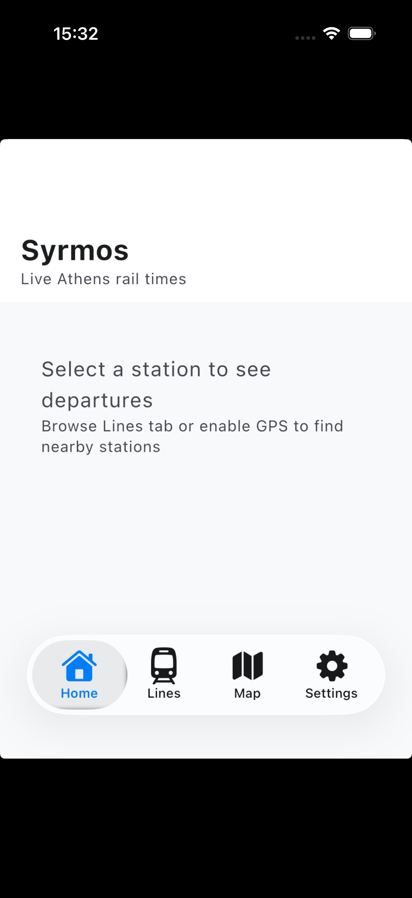
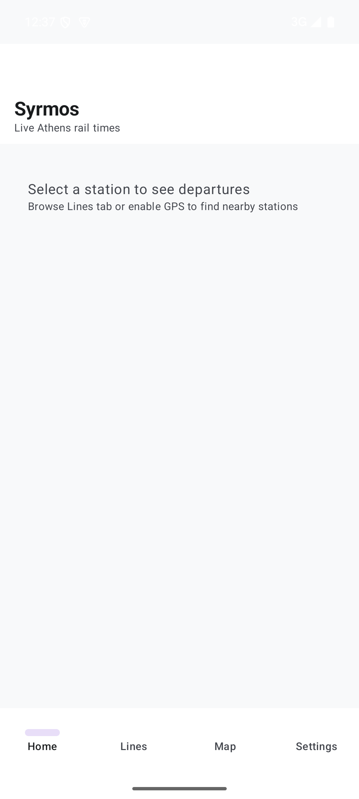
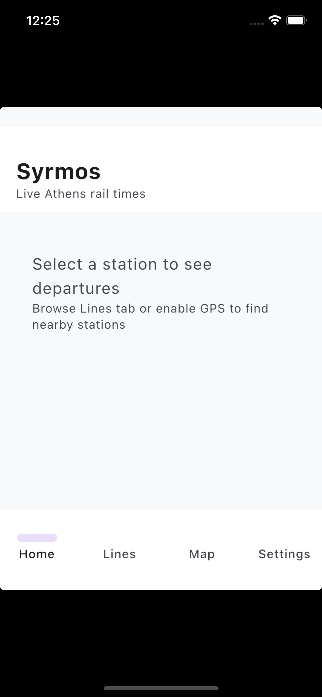

# Syrmos

**Live Athens rail times, all in one place.**

A Kotlin Multiplatform transit companion for the Athens metro, tram and suburban railway. Select a station or let GPS find the nearest one, and get a live countdown to the next train. Offline-first, with schedule data embedded directly in the app.

> *Syrmos (συρμός)* is the Greek word for a train consist, the carriages that form a metro train.

<p align="center">
  
  
  
</p>
<p align="center"><sub>iPhone 17 (iOS 26, liquid glass) · Pixel 8 (Android 15) · Web (Wasm)</sub></p>

---

## Background

I ride the Athens metro and suburban railway almost every day. Line 2 to work, Line 3 to the airport, the Proastiakos when heading south. The question is always the same: how long until the next one?

The official operator apps handle buses well, but rail is scattered across separate websites and buried PDF timetables. STASY covers metro and tram. Hellenic Train covers the suburban railway. Neither provides a single answer to "when does my train come" across all three networks.

I grew up in Tripolis, in the Peloponnese. The railway used to reach my city, and I would like to see it return. Building better tools for the network we have is a small step toward valuing the network we could have.

Syrmos started as a personal itch. If it becomes useful for other daily commuters, even better.

## How it works

**Find your station.**
- GPS detects the nearest station when above ground or near an entrance.
- Browse by line and pick manually from the station list.
- Search by name in English or Greek.

**See the next trains.**
All schedule data ships with the app. No internet needed. The engine reads the current Athens time, resolves the day type (weekday, Friday, Saturday, Sunday), queries the local SQLDelight database and calculates a countdown: "Line 3 towards Airport in 4 min".

**Offline by design.**
Station coordinates, timetables, frequencies and transfer connections are parsed from official PDF sources and embedded as JSON seed data. On first launch a `DataSeeder` populates a local database. Underground with no signal, the app still works.

## Features

- Live departure countdown at any station, any line, any direction
- GPS nearest station detection (Haversine distance, sorted by proximity)
- Line browser grouped by type with station counts and terminal names
- Station detail with all connecting lines and next departures across directions
- Full timetable viewer with day type filtering
- Schematic transit map rendered with Compose Canvas
- Bilingual support (English, Greek)
- Light and dark theme with Metro Blue branding

## Transit coverage

| Mode | Lines | Stations | Operator |
|------|-------|----------|----------|
| Metro | Line 1 (Green), Line 2 (Red), Line 3 (Blue) | 65+ | STASY |
| Tram | T6 (Syntagma-Pikrodafni), T7 (Akti Posidonos-Voula) | 50+ | STASY |
| Suburban | Airport-Piraeus, Piraeus-Kiato, Kiato-Aigio | 30+ | Hellenic Train |

## Architecture

Multi-module MVI with unidirectional data flow. Feature modules depend only on core abstractions. No feature-to-feature coupling.

```
androidApp / iosApp
    |
composeApp (composition root, tab navigator, Koin wiring)
    |
feature/ (home, lines, stations, schedule, map, settings)
    |           each: Screen + ViewModel + UiState
    |
core/domain (use cases: GetNextDepartures, FindNearestStation, PlanJourney, ...)
    |
core/data (repositories, DataSeeder, JSON seed resources)
    |
core/database (SQLDelight schema, platform drivers, mappers)
core/network  (Ktor client scaffold for future live API)
core/designsystem (SyrmosTheme, shared components)
core/navigation (Voyager tab/screen routes)
core/model (domain data classes, zero dependencies)
core/common (Result type, datetime utils, Haversine distance)
```

### Key decisions

| Decision | Rationale |
|----------|-----------|
| SQLDelight over Room | Mature KMP support including wasmJs web worker driver. Room KMP is newer and less tested on three targets. |
| Voyager over Decompose | Lower ceremony for a tab-based app. Integrated ScreenModel and Koin plugin. Decompose adds value for deep component trees but adds boilerplate here. |
| Embedded JSON over hardcoded data | Seed files can be regenerated from updated PDFs without touching code. Versioned seeder allows future data updates. |
| MVI over MVVM | Sealed Intent classes make state transitions explicit and testable. Single UiState per screen simplifies Compose recomposition. |
| Convention plugins | 15+ modules sharing the same KMP targets, SDK versions and Compose config. `build-logic/` eliminates drift. |
| Compose Canvas for map | Avoids Google Maps / MapKit dependencies. Schematic transit maps suit rail better than geographic maps. Fully cross-platform. |

### Tech stack

| Dependency | Version | Role |
|------------|---------|------|
| Kotlin | 2.1.20 | Language, all targets |
| Compose Multiplatform | 1.8.0 | Shared UI (iOS stable) |
| SQLDelight | 2.1.0 | Local database, wasmJs support |
| Koin | 4.1.1 | Dependency injection |
| Ktor | 3.1.1 | HTTP client (future live data) |
| Voyager | 1.1.0-beta03 | Multiplatform navigation |
| kotlinx-datetime | 0.6.2 | Athens timezone schedule calculations |
| kotlinx-serialization | 1.8.0 | JSON seed data parsing |

## Getting started

### Prerequisites

- JDK 17+
- Android Studio Ladybug or later
- Xcode 15+ (iOS, macOS only)

### Android

```bash
./gradlew :androidApp:installDebug
```

### iOS (via Kujto)

```bash
# Using Kujto (https://github.com/peterdsp/kujto)
./simulator.sh

# Or with options
./simulator.sh --device "iPhone 16" --clean
./simulator.sh --release
./simulator.sh --list        # show available schemes and devices
./simulator.sh --stop        # terminate and shutdown
```

The `simulator.sh` script auto-detects the Xcode project, picks the latest iPhone simulator, builds, installs and streams logs. It delegates to [Kujto](https://github.com/peterdsp/kujto) if installed, otherwise runs a standalone flow.

### Web

```bash
./gradlew :composeApp:wasmJsBrowserRun
```

For a production web deploy, stage the complete site bundle first:

```bash
./gradlew :composeApp:stageWebRelease
```

Deploy everything from `composeApp/build/web-release/`, not just `index.html` and `composeApp.js`. The wasm build emits hashed `.wasm` files that must be published alongside the HTML, JS and favicon.

### Tests

```bash
./gradlew allTests
```

## Module index

| Module | Files | Purpose |
|--------|-------|---------|
| `:core:model` | `transit/`, `schedule/`, `planner/`, `settings/`, `location/` | Pure domain data classes. Leaf module, no internal deps. |
| `:core:common` | `result/`, `extensions/`, `dispatcher/` | SyrmosResult, Athens time helpers, Haversine geo distance. |
| `:core:database` | `SyrmosDatabase.sq`, drivers, mappers | 9-table SQLDelight schema. Android, iOS, Web drivers. |
| `:core:data` | `seed/`, `repository/` | JSON seed files, DataSeeder, repository implementations. |
| `:core:domain` | `usecase/` | GetLines, GetNextDepartures, FindNearestStation, SearchStations, etc. |
| `:core:network` | `SyrmosApi`, `NetworkModule` | Ktor client placeholder for future OASA live data. |
| `:core:designsystem` | `theme/`, `component/` | SyrmosTheme, LineColorIndicator, DepartureCard, StationListItem. |
| `:core:navigation` | `SyrmosTab`, `Routes` | Voyager tab definitions and push-navigation constants. |
| `:feature:home` | `HomeScreen`, `HomeViewModel` | GPS nearest stations, departure countdowns, empty state guidance. |
| `:feature:lines` | `LinesScreen`, `LinesViewModel` | Line browser grouped by Metro/Tram/Suburban with card navigation. |
| `:feature:stations` | `StationDetailScreen`, `StationDetailViewModel` | Station info, connecting lines, sorted departures across directions. |
| `:feature:schedule` | `ScheduleScreen` | Full timetable with day type and direction selectors. |
| `:feature:map` | `MapScreen` | Schematic transit map drawn with Compose Canvas. |
| `:feature:settings` | `SettingsScreen` | Language, theme, data version, about. |

## Data sources

All schedule data is extracted from official PDF timetables published by:

- [STASY](https://www.stasy.gr) - Metro Lines 1, 2, 3 and Tram
- [Hellenic Train](https://www.hellenictrain.gr) - Suburban Railway (Proastiakos)

Syrmos is not affiliated with STASY, Hellenic Train or OASA.

## Roadmap

- [x] Multi-module KMP project with convention plugins
- [x] Domain models, database schema, seed data
- [x] Repositories, use cases, dependency injection
- [x] Design system with transit line colors
- [x] Tab navigation with Voyager
- [x] Feature screens: Home, Lines, Stations, Schedule, Map, Settings
- [x] Route planner with Dijkstra pathfinding across interchange graph
- [x] Unit tests for core utilities (datetime, geo distance, Result type)
- [x] GitHub Actions CI (macOS, JDK 17, iOS simulator build + tests)
- [x] iOS Xcode project with SwiftUI wrapper and GPS location permission
- [x] Departure timetables for Line 3 airport trains and Tram T6
- [x] Xcode project generation via XcodeGen
- [ ] Remaining timetables (Lines 1, 2, T7, Suburban)
- [ ] Live data integration when OASA API becomes available
- [ ] Service disruption alerts
- [ ] Home screen widgets (Android Glance, iOS WidgetKit)
- [ ] Accessibility audit and VoiceOver/TalkBack support

## License

MIT. See [LICENSE](LICENSE).
