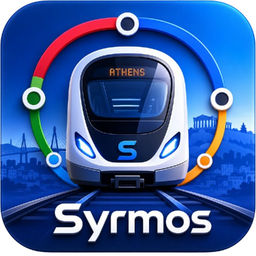

<p align="center">
  
</p>

<h1 align="center">Syrmos</h1>

<p align="center">
  <strong>Your next Athens train, instantly.</strong><br/>
  Metro &bull; Tram &bull; Suburban Railway
</p>

<p align="center">
  
  
  
  
  
</p>

<p align="center">
  <a href="https://apps.apple.com/app/syrmos"></a>
  &nbsp;
  <a href="https://play.google.com/store/apps/details?id=com.syrmos.android"></a>
  &nbsp;
  <a href="https://syrmos.peterdsp.dev"></a>
</p>

---

Syrmos is a transit companion for the Athens metro, tram and suburban railway. Pick a station or let GPS find the nearest one and get a live countdown to your next departure. Works offline, underground, with no signal.

> *Syrmos (συρmos)* is the Greek word for the carriages that form a metro train.

<table align="center">
  <tr>
    <td align="center">
      
    </td>
    <td align="center">
      
    </td>
    <td align="center">
      
    </td>
    <td align="center">
      
    </td>
  </tr>
  <tr>
    <td align="center"><sub>Home</sub></td>
    <td align="center"><sub>Lines</sub></td>
    <td align="center"><sub>Live Map</sub></td>
    <td align="center"><sub>Settings</sub></td>
  </tr>
</table>

## Features

- **Instant departures** at any station, any line, any direction
- **GPS nearest station** detection sorted by walking distance
- **Live train map** with simulated metro/tram positions and real-time suburban tracking
- **Realistic movement** with station dwell, acceleration and deceleration curves
- **Custom station and vehicle icons** shared across all three platforms
- **Line browser** grouped by Metro, Tram, and Suburban with station counts
- **Station detail** with connecting lines, interchange info, and next departures
- **Full timetable viewer** with weekday, Friday, Saturday, and Sunday schedules
- **Bilingual** interface in English and Greek
- **Light and dark theme** with Metro Blue branding
- **Fully offline** with all schedule data embedded in the app

## Transit coverage

| Mode | Lines | Stations | Operator |
|------|-------|----------|----------|
| Metro | Line 1 (Green), Line 2 (Red), Line 3 (Blue) | 71 | STASY |
| Tram | T6 (Syntagma-Pikrodafni), T7 (Akti Poseidonos-Voula) | 56 | STASY |
| Suburban | A1, A2 (Airport), A3 (Chalcis), A4 (Kiato) | 68 | Hellenic Train |

## Platforms

All three platforms run from a single Kotlin Multiplatform codebase and share the same train simulation engine, schedule logic, data layer, and icon assets.

| Platform | UI | Map |
|----------|-------|-----|
| **iOS** | SwiftUI + MapKit | Apple Maps with polylines and train annotations |
| **Android** | Compose + osmdroid | OpenStreetMap with PNG vehicle/station markers |
| **Web** | Compose for Web (Wasm) + Leaflet | OpenStreetMap with SVG directional train icons |

## Getting started

### Prerequisites

- JDK 17+
- Android Studio Ladybug or later
- Xcode 16+ (for iOS)

### Android

```bash
./gradlew :androidApp:installDebug
```

### iOS

```bash
./simulator.sh
```

The script auto-detects the Xcode project, picks the latest simulator, builds, installs, and streams logs.

```bash
./simulator.sh --device "iPhone 16 Pro" --clean    # specific device
./simulator.sh --release                            # release build
./simulator.sh --list                               # show devices
```

### Web

```bash
./gradlew :composeApp:wasmJsBrowserRun
```

Production deploy:

```bash
./gradlew :composeApp:stageWebRelease
# Output: composeApp/build/web-release/

# Or deploy directly to syrmos.peterdsp.dev:
./scripts/deploy-web-to-pi.sh
```

### Tests

```bash
./gradlew allTests
```

## Architecture

Multi-module MVI with unidirectional data flow. 15+ Gradle modules managed by convention plugins in `build-logic/`.

```
iosApp (SwiftUI, MapKit, native iOS experience)
androidApp (Compose Activity shell)
    |
composeApp (KMP composition root, tab navigator, Koin wiring)
    |
feature/ -- home, lines, stations, schedule, map, settings
    |        each: Screen + ViewModel + UiState
    |
core/ -- domain    (use cases)
      -- data      (repositories, seed data, DataSeeder)
      -- database  (SQLDelight, platform drivers)
      -- network   (Ktor, live train feeds)
      -- designsystem (theme, shared components)
      -- navigation (Voyager tabs and routes)
      -- model     (domain data classes)
      -- common    (Result type, datetime, geo distance)
```

### Tech stack

| Dependency | Role |
|------------|------|
| Kotlin 2.1 | Language (Android, iOS, Web) |
| Compose Multiplatform 1.8 | Shared UI |
| SwiftUI + MapKit | Native iOS app |
| SQLDelight 2.1 | Local database (all platforms) |
| Koin 4.1 | Dependency injection |
| Ktor 3.1 | HTTP client (live train feed) |
| Voyager 1.1 | Multiplatform navigation |
| osmdroid | Android map tiles |
| Leaflet.js | Web map tiles |
| kotlinx-datetime | Athens timezone calculations |

## Data sources

Schedule data is extracted from official PDF timetables published by:

- [STASY](https://www.stasy.gr) - Metro Lines 1, 2, 3 and Tram
- [Hellenic Train](https://www.hellenictrain.gr) - Suburban Railway

Live train positions from the [Hellenic Train API](https://railway.gov.gr).

Syrmos is not affiliated with STASY, Hellenic Train, or OASA.

## Privacy

Syrmos does not collect, store, or transmit personal data. Location is processed on-device only. No analytics, no ads, no tracking. See [Privacy Policy](docs/PRIVACY_POLICY.md).

## License

BSD 3-Clause. See [LICENSE](LICENSE).

Schedule data is derived from publicly available timetables by STASY and Hellenic Train. Live positions from the Hellenic Train API. Syrmos is not affiliated with any Greek transport authority.
